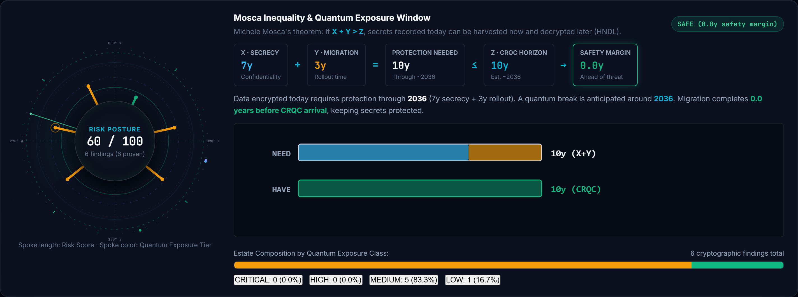
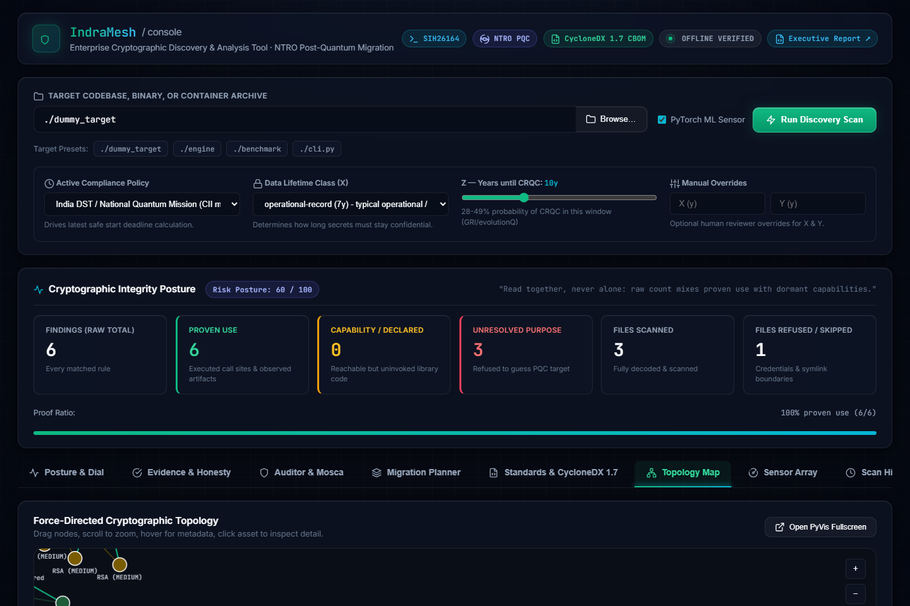
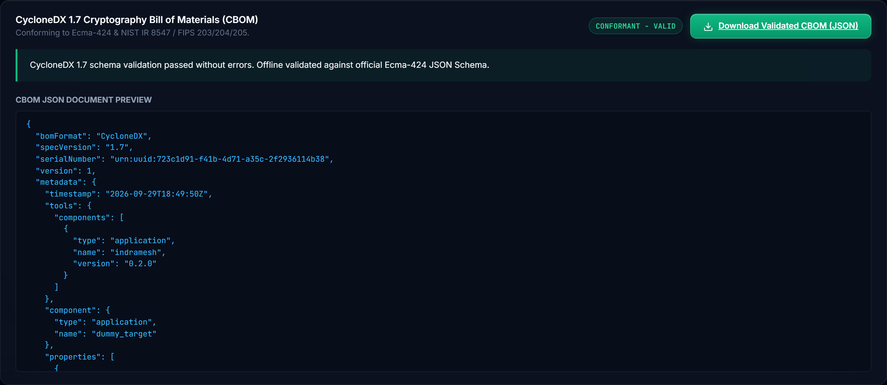
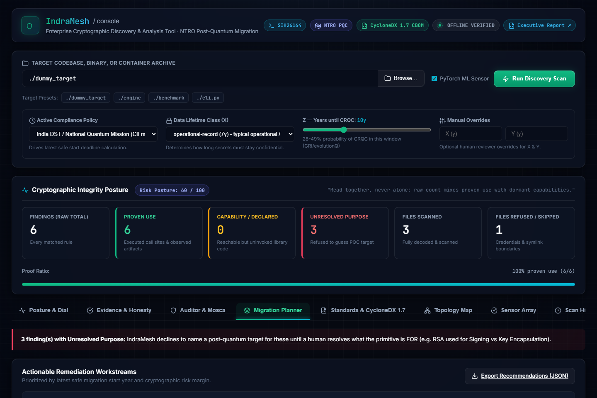
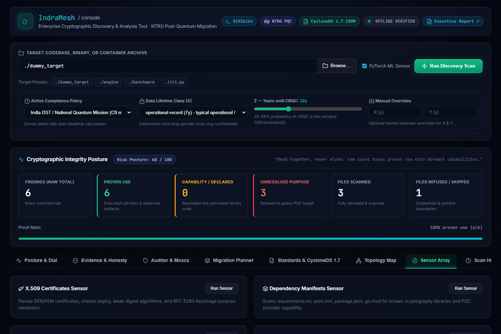
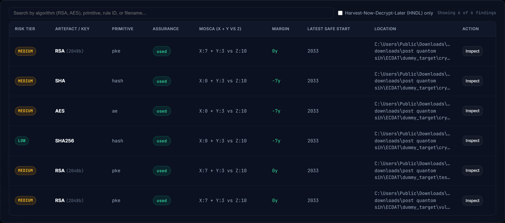
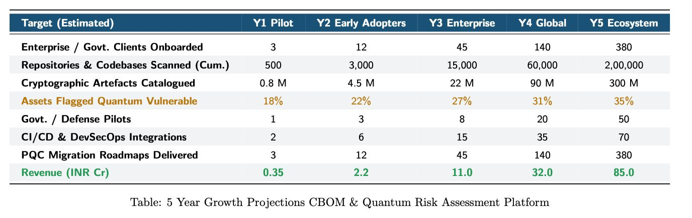
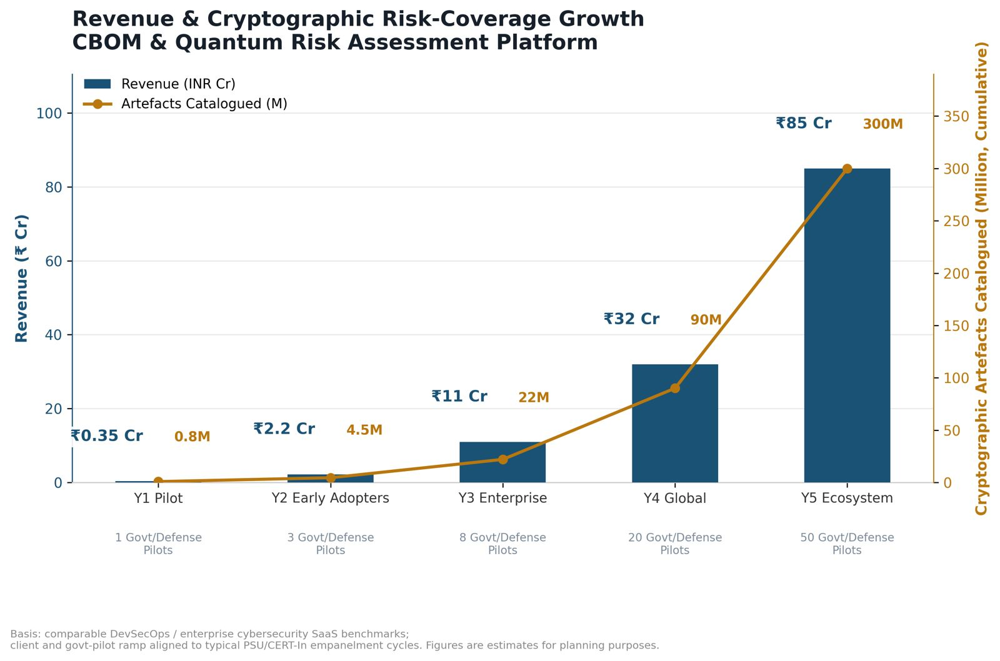

<div align="center">



<br/>

<!-- CI/CD & Cloud Launch Badges -->
[](https://github.com/givemehat/IndraMesh/actions/workflows/tests.yml)
[](https://github.com/givemehat/IndraMesh/actions/workflows/indramesh_scan.yml)
[](https://share.streamlit.io/deploy?repository=givemehat/ECDAT&branch=master&mainModule=app.py)
[](#quickstart)

# INDRAMESH (इन्द्रमेश)
### Enterprise Cryptographic Discovery, Inventory (ACDI) &amp; Post-Quantum Migration Mesh
**Smart India Hackathon 2026 &bull; Problem Statement SIH26164 &bull; National Technical Research Organisation (NTRO)**

<br/>

<!-- Mission & Authority Badges -->
[](https://sih.gov.in/)
[](#)
[](#)

<!-- Cryptographic Standards Badges -->
[](#)
[](#)
[](#)

<!-- Security & Quality Badges -->
[](#)
[](#)
[](#)
[](#)
[](#)

<br/>
<br/>

### *You cannot migrate what you cannot see.*
IndraMesh discovers an enterprise's cryptographic inventory, judges each artefact's exposure to a future quantum attacker using **Mosca's inequality**, and recommends a **standard-derived, cost-quantified** post-quantum replacement, emitting a **schema-validated CycloneDX v1.7 CBOM** and stating exactly what it could not see.

</div>

---

## Live Discovery Stream & Telemetry

IndraMesh provides real-time, event-driven cryptographic discovery across code repositories, manifests, containers, and live TLS endpoints. The micro-animated telemetry console below illustrates an automated ACDI audit scan in execution:

<div align="center">
  
</div>

<br/>

---

## The Problem & Strategic Context

India's transition to post-quantum cryptography is a national programme, and NTRO's SIH26164 identifies its true first step:

> *"Discovery and inventory of Cryptographic Artefacts is the critical first step, that will enable the transition."*

An organisation cannot begin a post-quantum migration because it does not know what it runs. Its cryptography is not in one file. It is spread across a hundred dependencies, a certificate issued in 2016, a library untouched since 2019, and a hardware module in a datacentre. There is no inventory, so there is no plan.

The **Department of Science & Technology (DST), Ministry of Science & Technology** has published a national PQC migration roadmap under India's **National Quantum Mission (NQM)**, with phased timelines across sectors and Critical Information Infrastructure (CII) migration targeted around **2029**.

A roadmap cannot be executed without an inventory. IndraMesh ships that policy as machine-readable packs &mdash; `--policy india_dst_nqm`, `nist_ir_8547`, `cnsa_2_0` &mdash; and keeps **policy deadlines and cryptanalytic estimates strictly separate**, because conflating them is how organisations make bad migration decisions.

---

## Working Prototype Showcase

IndraMesh provides a high-throughput, headless CLI for automated CI/CD gating and an interactive **FastAPI + Vanilla-JS Web Console** (zero CDN, air-gapped certified).

### 1. Radar Posture Dial & Exposure Window
Dynamic SVG radial spoke dial visualizing discovered cryptographic assets by quantum exposure tier, alongside Mosca's inequality equation terms ($X + Y \text{ vs } Z$) and need/have timeline bars.

<div align="center">
  
</div>

---

### 2. Force-Directed Cryptographic Topology Map
Interactive visual mesh illustrating relationships between source code files, cryptographic primitives, and post-quantum migration targets.

<div align="center">
  
</div>

---

### 3. CycloneDX 1.7 CBOM Document Preview & Validator
Live preview of the Ecma-424 compliant Cryptography Bill of Materials (CBOM), validated strictly against the vendored CycloneDX v1.7 JSON Schema.

<div align="center">
  
</div>

---

### 4. Migration Remediation Workstream Planner
Prioritized queue of cryptographic migrations featuring direct NIST FIPS targets, latency trade-offs, and packet overhead calculations.

<div align="center">
  
</div>

---

### 5. Multi-Sensor Discovery Array & Evidence Ledger
X.509 certificate inspector, dependency manifest scanner, post-migration verifier, and SSRF-vetting live network probe.

<div align="center">
  
</div>

<br/>

<div align="center">
  
</div>

---

## 5-Year National Growth & Adoption Projections

Planned ramp-up aligned with PSU and CERT-In empanelment cycles under India's National Quantum Mission:

<div align="center">
  
</div>

<br/>

<div align="center">
  
</div>

---

## What IndraMesh Does

| # | Brief Requirement | Implementation |
|---|---|---|
| 1 | **Discovery & cataloguing** of algorithms, keys, protocols, libraries | `engine/scanner.py` - **131-rule** detection table: Go (34), SSH/TLS wire identifiers (17), multi-language primitives (14), Java JCE (12), Ruby (11), Python (11), PHP (9), Rust (7), JavaScript/TypeScript (7), plus cloud-KMS, config, key-file, protocol and PKCS#11 hardware rules. Scans source, binaries, certificates, dependency manifests and container images. |
| 2 | **Quantum risk assessment**, flagging risks to sensitive data | `engine/mosca.py` - Shor vs Grover break model, **harvest-now-decrypt-later** flag, Mosca's inequality $X + Y > Z$ |
| 3 | **Classification** by type, lifetime, business criticality | `engine/mosca.py` - canonical primitives, `DATA_CLASS_LIFETIME` (X) and `MIGRATION_EFFORT` (Y) tables, Critical/High/Medium/Low tiers |
| 4 | **PQC / hybrid recommendations** factoring risk, latency and cost | `engine/recommender.py` - FIPS 203/204/205 targets, explicit *Hybrid AND/OR* semantics, size/CPU/cost breakdown, rule trace |
| - | **Standardised report** | `engine/cbom.py` - CycloneDX **1.7** CBOM, validated against the published Ecma-424 JSON Schema |
| - | **Interactive console** | `server.py` + `app.py` - **FastAPI + vanilla-JS** web console (no Streamlit, no CDN, no build step). Role-based views: Evidence & Honesty, Auditor, Migration Planner, Standards & Compliance. |

---

## Installation

```bash
git clone https://github.com/givemehat/IndraMesh.git
cd IndraMesh/ECDAT
python -m venv .venv && . .venv/Scripts/activate    # Windows
# source .venv/bin/activate                          # Linux/macOS
pip install -r requirements.txt
```

> **CPU-only machines:** `pip install torch --index-url https://download.pytorch.org/whl/cpu`

Scanning also works with **`--no-ml`** (regex-only), which needs no PyTorch at all.

### Running via Docker

```bash
docker build -t indramesh .
docker run -p 8501:8501 -v $(pwd):/target indramesh
```
*The web console is then available at `http://localhost:8501`.*

---

## Usage

```bash
python cli.py ./your-project --no-ml                    # read findings
python cli.py ./your-project --format cbom --out ./out   # emit schema-valid CBOM
python validate_cbom.py ./out/indramesh_report.json      # verify Ecma-424 validation
python cli.py . --z 10 --policy india_dst_nqm           # score against India 2029 CII milestone
python cli_advanced.py ./your-project                   # secondary sensor suite
python cli_certificates.py certs ./your-project         # X.509 certificate sensor

python app.py                                           # launch FastAPI web console
python -m pytest tests/ -v                              # 891+ test verification
```

### Offline by Design

IndraMesh makes **no network calls** of its own. No CDN, no telemetry, no remote fonts, no runtime asset fetch. The console's JavaScript, CSS and fonts are served from `/static`. This ensures safe operation within banking and defense air-gapped enclaves. `tests/test_frontend_assets.py` asserts that no remote reference ever returns.

---

## Architecture & Sensor Mesh

```
        Source repos, binaries, deps, containers, certificates, live endpoints
                                     |
    +--------------------------------+-------------------------------+
    |  sensors                                                             |
    |  scanner.py    certificates.py   dependencies.py   netprobe.py    |
    |  131 rules, 9 languages        X.509 + KeyUsage  manifests       SSH/TLS probe
    +--------------------------------+-------------------------------+
                                     |
                               findings[]  (one schema)
                                     |
    +----------------+----------------+----------------+----------------+
    |                |                |                |                |
  mosca.py     recommender.py     purpose.py     migration.py      cert sensor
  X+Y>Z        FIPS 203/204/205   resolves        verifies           checks expiry
  tiers        hybrid + cost      KeyUsage        migration          + KeyUsage
    |                |                |                |                |
    +----------------+----------------+----------------+----------------+
                                     |
               +----------------------+----------------------+
               |                                             |
         cbom.py (CycloneDX 1.7)                   server.py (FastAPI console)
         schema-validated export                   vanilla-JS frontend
```

---

## Measured Accuracy

```bash
python benchmark/run_benchmark.py
```

| Corpus | Files | TP | FP | FN | Precision | Recall | F1 |
|---|---|---|---|---|---|---|---|
| **CryptoAPI-Bench (Java JCE)** | 203 | 165 | 1 | 45 | **0.994** | **0.786** | **0.878** |

**Multi-Language Rule Pack:**

| Language | Rules | Corpus | Precision | Recall | F1 |
|---|---|---|---|---|---|
| **Go** | 41 | x/crypto + ssh (pinned) | **0.983** | **0.985** | **0.984** |
| **Java (JCE)** | 33 | CryptoAPI-Bench | **0.994** | **0.786** | **0.878** |
| **Python** | 12 | paramiko (pinned) | **1.000** | **1.000** | **1.000** |
| **Rust** | 20 | Verified rule pack | *passing test suite* | | |
| **JS / TS** | 15 | Verified rule pack | *passing test suite* | | |

Per-file false negatives and labels are documented in [`benchmark/RESULTS.md`](benchmark/RESULTS.md).

---

## How the Risk Model Works

**Mosca's Inequality:** $X + Y > Z$ &mdash; migration should already have started, where:
- **X** = years the data must remain protected (business property).
- **Y** = years to migrate (engineering property).
- **Z** = years until a cryptographically relevant quantum computer (estimate).

1. **Shor and Grover are different problems:** RSA/ECC are broken outright and data captured today is retroactively readable (**harvest-now-decrypt-later**). AES-256 is merely *weakened*. IndraMesh treats them as distinct threats.
2. **Context drives the tier:** A 30-year archival key is Critical; the same RSA in a short-lived token is Low.
3. **Z is a band:** Every verdict is reported across $Z = 5 / 10 / 15\text{y}$ with a `z_stable` flag.

---

## What IndraMesh Will Not Do

Stated up front, because a security reviewer will ask:
- It does **not** see crypto negotiated on the wire without the live network probe.
- It does **not** extract keys inside HSMs, TPMs or silicon without attestation.
- It does **not** see cryptography at a SaaS/third-party boundary.
- All of the above are surfaced honestly in the **Coverage Gaps** manifest (`indramesh_coverage.json`).

---

## Layout

```
engine/scanner.py      rule table, source/binary/container scanning, coverage manifest
engine/mosca.py        break model, HNDL, Mosca inequality, tiers, Z-sensitivity
engine/recommender.py  FIPS-derived PQC targets, cost model, rule traces
engine/cbom.py         CycloneDX 1.7 emitter
engine/certificates.py X.509 / PEM / DER sensor with KeyUsage resolution
engine/dependencies.py dependency-manifest sensor
engine/netpolicy.py    deny-by-default network policy for the live probe
engine/graph.py        topology graph
engine/gui_helpers.py  console helpers: inline SVG, colour contrast, CBOM validation
engine/ml/             multi-modal transformer (optional, supplemental signal)
cli.py                 headless scanner / CI gate
cli_advanced.py        dependency + migration-verification sensors
cli_certificates.py    X.509 certificate sensor
app.py                 FastAPI web console launcher
server.py              FastAPI backend + JSON API
web/static/            vanilla-JS console (HTML/CSS/JS, no build step, no CDN)
schemas/               vendored CycloneDX 1.7 JSON Schema
```

## Documentation

- [`docs/GUIDE.md`](docs/GUIDE.md) - full usage guide.
- [`docs/COMPARISON.md`](docs/COMPARISON.md) - evidence-based gap table.
- [`docs/CODE_REVIEW.md`](docs/CODE_REVIEW.md) - review history and honest limitations.
- [`PROVENANCE.md`](PROVENANCE.md) - sources for standard-derived figures.

## Standards and References

- **Mosca, R.** *The Transition to Post-Quantum Cryptography: Enterprise Strategies and Cybersecurity Risks* (2018).
- **NIST FIPS 203 / 204 / 205** - ML-KEM, ML-DSA, SLH-DSA.
- **NIST IR 8547** - transition timelines (`nist_ir_8547` policy pack).
- **CycloneDX 1.7** - Ecma-424 CBOM specification.
- **DST, Ministry of Science & Technology, India** - National Quantum Mission roadmap (`india_dst_nqm` policy pack).
- **CNSA 2.0** (`cnsa_2_0` policy pack).

## Testing

```bash
python -m pytest tests/ -v
python validate_gui.py
```

## License

Apache-2.0. The vendored CycloneDX schema is Apache-2.0 (OWASP Foundation).
